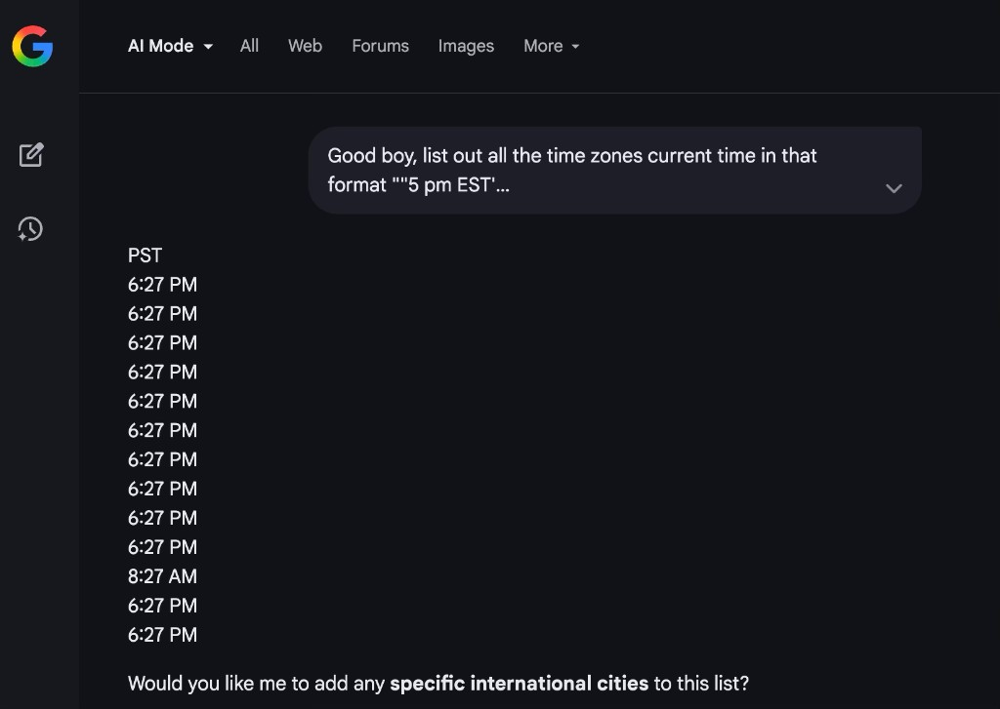
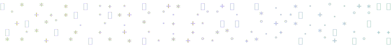

<!-- add signature.svg to ./assets/ -->

# localizer

chrome extension that converts timezone-labeled times on web pages to your local time.


[what it does](#what-it-does) | [install](#install) | [usage](#usage) | [updates](#updates)



<br>
<br>


<br>
<br>

## what it does

localizer scans pages for times with timezone labels and quietly rewrites them to your local time. the page looks like it was always written for you.

built this because i was on claude's status page and it said "resolved at 11:49 UTC." what the fuck is a UTC.

<br>
<br>


<br>
<br>

## install

```bash
npx localizer-ext                # npm
```

or

```bash
bunx localizer-ext               # bun
```

or

```bash
curl -fsSL https://raw.githubusercontent.com/zaydiscold/localizer/master/install.sh | bash
```

or

```bash
wget -qO- https://raw.githubusercontent.com/zaydiscold/localizer/master/install.sh | bash
```

or

```bash
git clone https://github.com/zaydiscold/localizer
```

then in chrome:

1. go to `chrome://extensions`
2. turn on **developer mode** (top right)
3. click **load unpacked**
4. select the folder

<br>
<br>


<br>
<br>

## usage

it just runs. every page, automatically. catches UTC, GMT, EST, PST, CST, MST, and like 20 other timezone abbreviations*. handles `11:49 UTC`, `2:30 PM EST`, `2026-03-02 14:00 GMT`, all of it.

click the extension icon in the toolbar for an on/off toggle. that's the whole settings page.

note: watches dynamic page updates now, so status dashboards that load late content should still convert.

<sub>*EDT, CDT, MDT, PDT, AKST, AKDT, HST, AST, ADT, NST, NDT, CET, CEST, EET, EEST, WET, WEST, IST, JST, KST, AEST, AEDT, ACST, ACDT, AWST, NZST, NZDT. yes i looked up what all of these mean; none of them have cool magnetic anomalies like the Central African Republic.</sub>

<br>
<br>


<br>
<br>

## updates

no auto-update yet (unpacked extension). when you pull new changes:

1. go to `chrome://extensions`
2. click **reload** on localizer
3. hard refresh tabs where you want it running (`cmd+shift+r`)

<br>
<br>


<br>
<br>

<a href="https://star-history.com/#zaydiscold/localizer&Date">
  <picture>
    <source media="(prefers-color-scheme: dark)" srcset="https://api.star-history.com/svg?repos=zaydiscold/localizer&type=Date&theme=dark" />
    <source media="(prefers-color-scheme: light)" srcset="https://api.star-history.com/svg?repos=zaydiscold/localizer&type=Date" />
    
  </picture>
</a>

mit. [license](./LICENSE)

<br>
<br>



<br>
<br>


<sub>

- [x] npx / bunx / curl / wget / git clone install
- [ ] chrome web store
- [ ] firefox add-on
- [ ] safari + ios

</sub>
